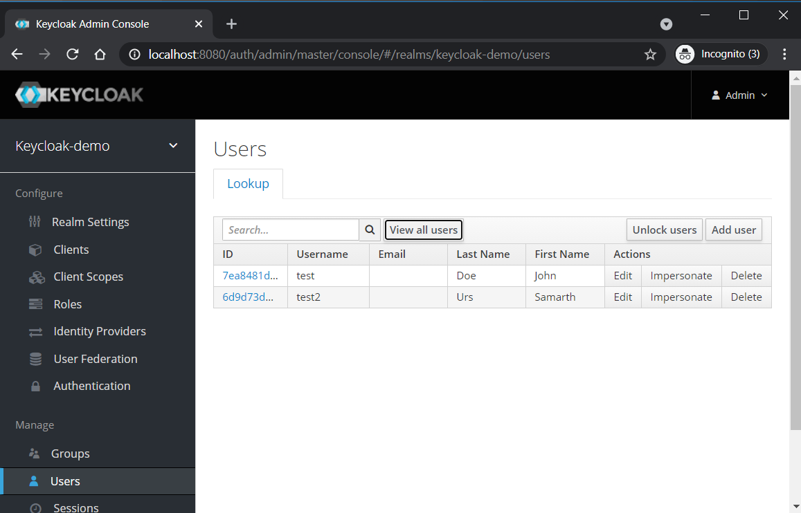
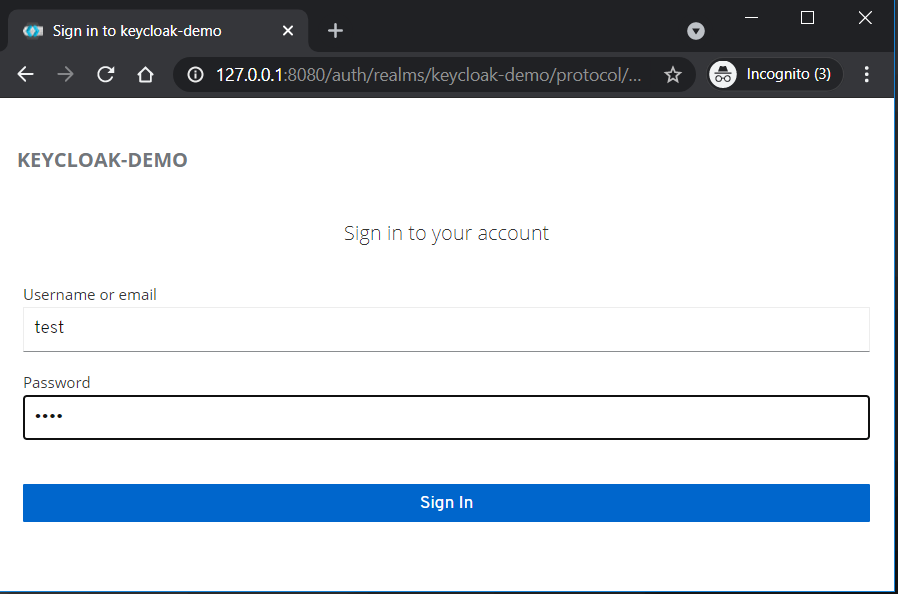
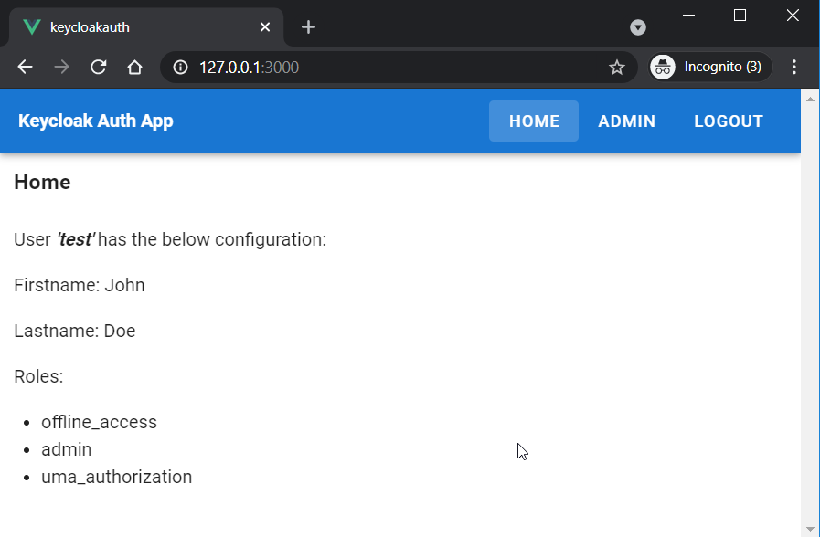
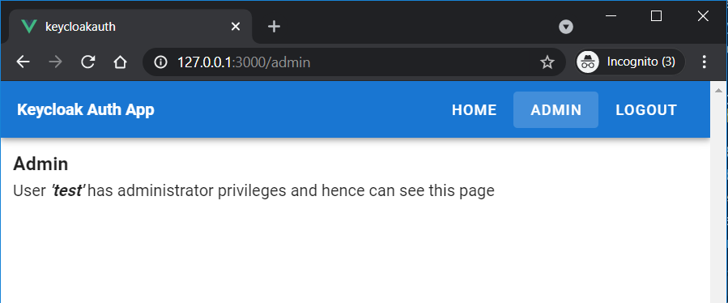
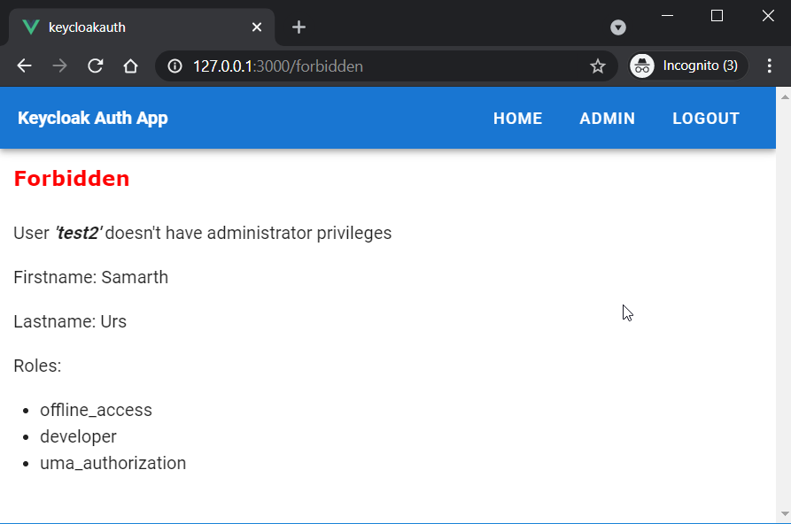

# vuejs-keycloak-auth
Use Keycloak as Authentication Provider for Vue.js application

Make use of the docker-compose file which will install the Keycloak server needed for the authentication and at the same time makes use
of the Dockerfile to build the Vue.js application.

## Project setup
```
docker-compose up -d --build
```

After the successful build of the above docker-compose up command, two applications Keycloak server and Vue.js application both will be running and 
available for use.

### 1. The Keycloak server can be accessed via http://localhost:8080
by default the Realm - "keycloak-demo" will be opened and there will be two users "test" and "test2" readily available under this keycloak-demo Realm.
Under the project you will find keycloak-config folder which has the realm file which will be imported by docker-compose during the creation of Keycloak server.



### 2. The application can be accessed via http://127.0.0.1:3000
User "test" has the roles "admin" and can access the Admin page.

```
username: test
password: test
```





Click on the "Admin" tab on the top right corner and as the user "test" has admin role, he is allowed to see the Admin page.



Now click on Logout and try logging with user "test2" who has only "developer" role but not "admin" role.

```
username: test2
password: test
```

Click on Admin page and user "test2" is Forbidden from seeing it.




 
